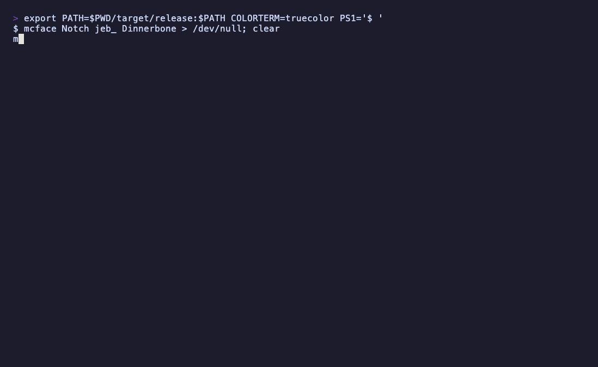

# mcface

A CLI that shows Minecraft (Java Edition) skin faces in the terminal.



```sh
mcface Notch                                  # player name
mcface 069a79f4-44e9-4726-a5be-fca90e38aaf5   # UUID (with or without hyphens)
mcface @steve @creeper -m half -s 2 --name    # built-in characters
mcface --random
mcface --all -m half                          # every built-in character with its name
```

## Install

macOS / Linux:

```sh
curl --proto '=https' --tlsv1.2 -LsSf https://github.com/mcrtabot/mcface/releases/latest/download/mcface-installer.sh | sh
```

Windows (PowerShell):

```powershell
powershell -ExecutionPolicy Bypass -c "irm https://github.com/mcrtabot/mcface/releases/latest/download/mcface-installer.ps1 | iex"
```

Prebuilt binaries are also on the [Releases](https://github.com/mcrtabot/mcface/releases) page. With a Rust toolchain:

```sh
cargo install --git https://github.com/mcrtabot/mcface
```

## Usage

| Option | Description |
| --- | --- |
| `-m, --mode block\|bg\|half` | `block`: `██` in the foreground colour (default) / `bg`: spaces in the background colour / `half`: `▀`, two pixels stacked in one cell |
| `-s, --scale N` | Integer scale factor (1–32) |
| `-n, --name` | Print the name under each face |
| `--no-overlay` | Leave out the hat (second) layer |
| `--color auto\|truecolor\|256\|16\|none` | Colour support. `auto` checks `NO_COLOR` / `COLORTERM` / `TERM`. `none` shades pixels with ASCII characters by brightness |
| `--json` | Print profile info and face pixels (`rrggbbaa`) as JSON, one object per line |
| `--png PATH` | Save the face as a PNG (scaled by `--scale`). With several targets, `{}` is replaced by each name |
| `-r, --random` | Add one random built-in character |
| `-l, --list` | List built-in characters (text) |
| `-a, --all` | Show every built-in face with its name (implies `--name`; works with `--mode`, `--scale`, `--json`, `--png`) |
| `--no-cache` | Neither read nor write the cache |

Multiple targets are fetched in parallel and shown side by side, wrapping at the terminal width (or `$COLUMNS`).

### Built-in characters

Use `@name`. Without `@` the argument is treated as a player name, since real players named `Steve` etc. exist.

- Default skins: steve, alex, ari, efe, kai, makena, noor, sunny, zuri
- Mobs (68): creeper, zombie, husk, drowned, skeleton, stray, bogged, wither_skeleton, enderman, spider, cave_spider, pig, cow, villager, iron_golem, piglin, blaze, ghast, slime, sheep, chicken, wolf, cat, ocelot, fox, rabbit, panda, polar_bear, bee, axolotl, frog, turtle, mooshroom, goat, llama, horse, donkey, parrot, squid, glow_squid, dolphin, bat, snow_golem, allay, strider, sniffer, armadillo, camel, copper_golem, wandering_trader, witch, pillager, vindicator, evoker, zombie_villager, zombified_piglin, piglin_brute, hoglin, zoglin, magma_cube, guardian, elder_guardian, warden, breeze, shulker, phantom, vex, ravager

Players without a custom skin get the same default skin Minecraft picks from their UUID hash.

## How it works

1. Name → UUID: `api.mojang.com/users/profiles/minecraft/<name>` (falls back to `api.minecraftservices.com/minecraft/profile/lookup/name/<name>` on failure)
2. UUID → skin URL: base64-decode `textures` from `sessionserver.mojang.com/session/minecraft/profile/<uuid>`
3. Cut the face (8,8) and hat (40,8) out of the skin PNG (`textures.minecraft.net`) and composite them

### Cache

Stored in `$MCFACE_CACHE_DIR`, or `<tmp>/mcface` if unset (`$TMPDIR/mcface` on macOS).

| Data | Lifetime |
| --- | --- |
| Name → UUID | 24 hours |
| Profile (skin URL) | 1 hour |
| Skin image | Forever (URLs are content hashes, so the content never changes) |

On network errors or HTTP 429, an expired cache entry is used if one exists.

## Development

The built-in face data in `src/builtin/builtin_data.rs` is generated from the official client jar's textures.

```sh
unzip client.jar 'assets/minecraft/textures/entity/*' -d ex
cargo run --example gen_faces -- ex/assets/minecraft/textures/entity --preview preview/
```

`--preview` also writes 16x PNGs for checking the result.

Releases are built by [dist](https://github.com/axodotdev/cargo-dist): bump `version` in `Cargo.toml`, then push a `vX.Y.Z` tag.

The demo GIF is recorded with [VHS](https://github.com/charmbracelet/vhs) and ffmpeg: `docs/demo.sh`.
